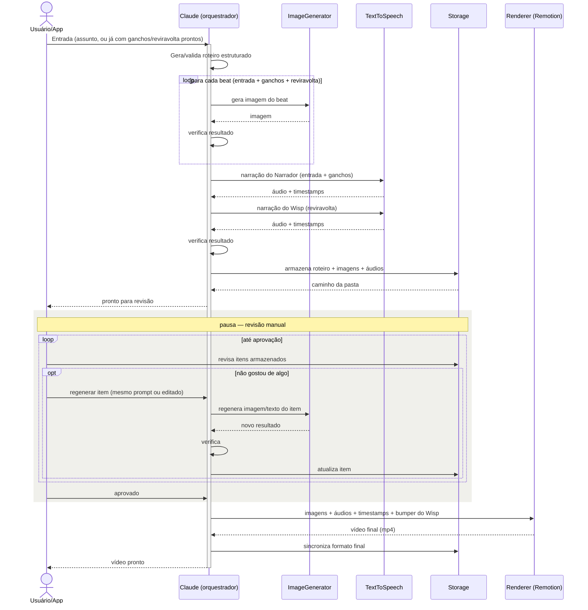

# Wisp — Plano Técnico

> Pipeline (majoritariamente automatizado, com pausas de revisão) que gera um vídeo curto vertical (formato Reels) por dia a partir de um assunto/frase: roteiro estruturado → narração em duas vozes + imagens geradas por IA → renderização com efeitos de movimento, legendas e o bumper do Wisp. Ritmo alvo: 1 vídeo/dia, priorizando qualidade sobre volume — não é uma operação de produção em massa, então custo raramente é o critério decisivo entre opções.
>
> Última atualização: 27 de agosto de 2026.

---

## Estado atual

| Fase | Status |
|---|---|
| 0 — Setup | ✅ concluída, validada de ponta a ponta na máquina real |
| 1 — Roteiro | ✅ código completo, testes unitários da lógica de validação passando; falta testar a chamada real ao Claude com API key |
| 2 a 6 | não iniciadas |

Ambiente: Node/TS + NestJS, Prisma 7.10.0 (versão fixada, sem `^`, no `package.json`), BullMQ, SQLite. Histórico completo de decisões e correções: `git log` (9 commits, um por mudança — nada foi reescrito do zero). Detalhes de setup e troubleshooting: `README.md`.

---

## 1. Estrutura narrativa (regras)

**Entrada → N Ganchos (variável) → Reviravolta**, onde um dos ganchos é marcado como "semente" (contém um detalhe estranho/incompleto) e a reviravolta precisa resolver especificamente essa semente — não uma ironia genérica.

```json
{
  "idioma": "pt-BR",
  "entrada": {
    "id": "e1",
    "texto": "João foi à padaria",
    "imagem_prompt": "menino indo em direção a uma padaria, manhã ensolarada"
  },
  "ganchos": [
    {
      "id": "g1",
      "texto": "João levou 10 reais",
      "imagem_prompt": "menino segurando uma nota de dinheiro",
      "semente": false
    },
    {
      "id": "g2",
      "texto": "João voltou pra casa com os pães e os 10 reais",
      "imagem_prompt": "menino caminhando com pão e dinheiro na mão",
      "semente": true
    }
  ],
  "reviravolta": {
    "texto": "Outro cliente tinha pago os pães do João",
    "imagem_prompt": "cliente sorridente pagando na padaria",
    "resolve": "g2"
  }
}
```

Regras a manter:
- `ganchos` é array de tamanho livre (recomendado: 2–5, por limite de duração do Reels).
- `resolve` deve apontar pra um `id` real dentro de `ganchos` — se o LLM não conseguir, é sinal de regenerar o roteiro.
- Cada nó (entrada, cada gancho, reviravolta) gera exatamente **uma imagem**.
- Duração alvo de narração: 15–30s (~40–75 palavras no total).
- `entrada` + `ganchos` são narrados pelo **Narrador**; `reviravolta` é narrada pelo **Wisp** (seção 2).

**Modos de entrada** (três níveis de controle, o pipeline aceita qualquer um):
1. **Só o assunto** — Claude gera ganchos e reviravolta do zero.
2. **Assunto + ganchos prontos** — Claude cria só a reviravolta e os `imagem_prompt` de cada item.
3. **Roteiro completo pronto** — Claude só valida a estrutura (checa se `resolve` aponta pra uma semente real) e gera os `imagem_prompt`.

Nos três modos a chamada ao Claude pra gerar `imagem_prompt` e validar a estrutura acontece de qualquer forma — o custo/latência dessa etapa não muda muito entre os modos.

**Regras de conteúdo**:
- A fala do Wisp (reviravolta) segue um guia de estilo próprio no prompt — sádico, irônico, **nunca diretamente cruel** — separado do prompt neutro usado pra entrada/ganchos. Esse é o limite de tom concreto pro personagem.
- Ainda em aberto: já que o sistema gera afirmações automaticamente sobre qualquer assunto, existe risco de desinformação. Decidir se o roteiro fica restrito a temas mais subjetivos/seguros (histórias cotidianas, curiosidades) ou se implementa alguma checagem antes de publicar.

---

## 2. Personagens: Narrador e Wisp

Dois personagens que não interagem entre si: o **Narrador** apresenta a história (entrada + ganchos), o **Wisp** entrega a reviravolta/ironia e encerra o vídeo. É a marca registrada do projeto.

### 2.1 Vozes

| | Narrador | Wisp |
|---|---|---|
| Cobre | entrada + ganchos | reviravolta |
| Tom | voz normal, sem característica chamativa | sádico, irônico, nunca cruel |
| Provedor | ElevenLabs | ElevenLabs |

**Por que ElevenLabs pras duas vozes**: o Wisp precisa de atuação real — controle de prosódia é o ponto forte do ElevenLabs, e isso importa mais que economizar centavos numa operação de 1 vídeo/dia. Bônus: como o conteúdo é bilíngue (PT-BR/EN), o ElevenLabs mantém a mesma identidade de voz nos dois idiomas.

Regra importante: o `voice_id` de cada personagem é **fixo para sempre**, nunca varia entre vídeos — diferente das imagens da história, onde alguma variação é tolerável.

Implementação: 2 chamadas de TTS por vídeo (uma por voz), áudios concatenados na montagem.

### 2.2 Identidade visual do Wisp

O Narrador é só voz. O Wisp tem forma visual — um efeito recorrente, **reutilizado em todo vídeo** (mesmo asset sempre, não gerado de novo a cada vez).

**Conceito**: fumaça cobre a tela → olhos e boca aparecem em meio à fumaça enquanto o Wisp fala → depois da fala, a fumaça se dissipa lentamente.

**Direção visual definida**: sorriso arredondado e simétrico, sem dentes, brilho âmbar pálido — não vermelho (referência "maligna" descartada por fugir do tom sarcástico-mas-não-cruel do personagem; "Wisp" remete a *will-o'-the-wisp*, luz fantasma pálida do folclore, nunca vermelha). O esboço aprovado é só referência de direção — o asset final merece mais capricho, já que é permanente.

**Por que a animação não pode ser um único vídeo gerado por IA**: a duração da fala do Wisp muda todo dia. Um clipe de vídeo gerado por IA tem duração fixa e nunca bateria exatamente com o áudio do dia.

**Abordagem — separar textura de controle de tempo**:
- Fumaça e rosto (olhos + boca) são **assets fixos**, feitos uma vez (fumaça: banco de vídeo ou IA, gerado uma única vez; olhos/boca: PNG/SVG separado, não embutido no vídeo de fumaça).
- Composição e tempo são feitos em código, no Remotion, que já lê a duração do áudio pra sincronizar legendas de qualquer forma.

**Estrutura em 3 fases (composição Remotion)**:
1. **Cobrir** (~1–1.5s fixo): fumaça entra, cobrindo a tela.
2. **Revelar + segurar** (**duração variável** = duração do áudio do Wisp menos as fases 1 e 3): olhos e boca aparecem por cima da fumaça, fumaça em loop curto por trás. ⚠️ Conferir a API atual do Remotion na hora de implementar (Fase 3.5) — `getAudioDurationInSeconds()` já está deprecated a favor de `getMediaMetadata()`, não fixar num nome de função por essas notas.
3. **Dissipar** (~1–1.5s fixo): olhos/boca somem, fumaça se abre.

Esse bumper é autocontido — dá pra prototipar em paralelo às Fases 1–3.

---

## 3. Arquitetura



### 3.1 Revisão manual (duas pausas)

**Pausa 1 — só texto** (só no modo 1): logo depois que o roteiro é gerado, antes de gastar com imagens.

**Pausa 2 — revisão completa** (sempre): depois que roteiro, imagens e áudios estão salvos no storage, antes do render.

**Estados do job** (campo `status` no Prisma, `prisma/schema.prisma`): `gerando_roteiro` → [`aguardando_revisao_roteiro` se modo 1] → `gerando_midia` → `aguardando_revisao` → `renderizando` → `concluido` (+ `falhou`).

**Mecanismo** (via CLI/endpoints simples, sem UI dedicada por enquanto):
- Os itens já estão em `storage/<job_id>/` — dá pra abrir direto.
- `regenerar item`: reroda a geração de um item específico, com o mesmo prompt ou um prompt editado, sobrescrevendo o arquivo.
- `aprovar`: avança o status.
- Troca manual do arquivo também funciona — o render só lê o que estiver na pasta.
- Se o texto de um gancho/reviravolta for editado, reaplicar a verificação de estrutura antes de aprovar.

### Estrutura de backend (Node.js / TypeScript, NestJS)

```
wisp-backend/
├── src/
│   ├── roteiro/         # geração do roteiro estruturado (Claude API) — Fase 1 ✅
│   ├── image-gen/       # interface ImageGenerator + implementações por provedor — Fase 3
│   ├── tts/              # interface TextToSpeech + implementações (Narrador/Wisp) — Fase 2
│   ├── render/            # composições Remotion + trigger de render — Fase 3.5/4
│   ├── storage/            # abstração local disk / S3-compatible
│   ├── pipeline/            # orquestrador — Fase 5
│   ├── queue/                 # processors do BullMQ — Fase 5
│   └── common/                  # tipos compartilhados (Roteiro) + PrismaService
├── remotion/                       # ainda vazio — Fase 3.5/4
├── prisma/schema.prisma             # modelos Job e ItemGerado
└── prisma.config.ts                   # config do Prisma 7 (fora da compilação do NestJS)
```

**Princípio central**: cada generator (imagem, TTS) fica atrás de uma **interface comum**, com uma implementação concreta por provedor — trocar de provedor não deve exigir mudar nada fora daquele módulo.

- **Fila**: BullMQ (Redis) — controla concorrência, retries automáticos, tracking de progresso.
- **Banco**: Prisma + SQLite no início; migrar pra Postgres se o volume justificar.
- **Storage**: disco local para desenvolvimento; migrar para S3-compatible (Cloudflare R2 é uma opção) em produção.
- **Render**: Remotion rodando dentro do próprio backend (ou worker separado).

---

## 4. Decisões de API por componente

### 4.1 Roteiro (LLM)

| Modelo | Preço (por MTok, entrada/saída) |
|---|---|
| Claude Haiku 4.5 | $1 / $5 |
| **Claude Sonnet 5** ✅ | **$2 / $10** |
| Claude Opus 5 | $5 / $25 |

**Recomendação**: Sonnet 5, chamada síncrona (sem Batch API — a latência de minutos/horas atrapalha o loop rápido de revisão, e a economia é centavos por mês nesse volume). Geração via `tool_use` com `tool_choice` forçado (GA desde 2024) — não o beta `output_format`, que exige header próprio e não lista suporte a Sonnet 5.

**Gateway alternativo**: `ANTHROPIC_BASE_URL`+`ANTHROPIC_AUTH_TOKEN`+`ANTHROPIC_MODEL` (`.env`) permitem trocar a Anthropic direta por um gateway como o OpenRouter, preservando `tool_use`/`tool_choice` sem tradução. Dois detalhes que erramos e corrigimos numa segunda checagem: gateways desse tipo autenticam com Bearer token (`ANTHROPIC_AUTH_TOKEN`, não `ANTHROPIC_API_KEY`, que usa `x-api-key`), e o nome do modelo no OpenRouter precisa do prefixo do provedor (`anthropic/claude-sonnet-5`, não só `claude-sonnet-5`). Não testado neste ambiente por falta de chave; conferir na conta do gateway se o modelo está disponível antes de assumir que funciona.

Custo estimado: **~$0,008 por roteiro**.

### 4.2 Narração (TTS)

**Recomendação**: **ElevenLabs** para as duas vozes — ver seção 2.1.

| Provedor | Preço (por 1M caracteres) | Timestamp por palavra nativo | Observação |
|---|---|---|---|
| Google Cloud (Standard/WaveNet) | $4 | ❌ | mais barato, sem timestamp nativo |
| Amazon Polly (Neural) | ~$16 (+~$16 se pedir timestamp) | ✅ | bom custo/feature, sem o controle de prosódia do ElevenLabs |
| Azure Speech (Neural) | $16–22 | parcial | |
| OpenAI TTS | $15–30 | ❌ | |
| **ElevenLabs (Multilingual v2/v3)** ✅ | **$100** | ✅ | melhor naturalidade; mesma identidade de voz em PT-BR e EN |

Custo estimado: **~$0,04 por vídeo** (2 chamadas — Narrador + Wisp).

### 4.3 Geração de imagem

| Provedor/modelo | Preço por imagem | Observação |
|---|---|---|
| GPT Image (Mini) | $0,005 | mais barato, consistência não testada |
| Google Imagen 4 (Fast) | $0,02 | bom custo-benefício |
| Google Imagen 4 (Standard/Ultra) | $0,04 / $0,06 | |
| **Nano Banana 2 (Lite)** ✅ | **~$0,034** | citado por força em consistência de personagem/estilo |
| Nano Banana 2 (padrão) | ~$0,067 | mesma vantagem, maior resolução |
| Flux 2 Pro | ~$0,055 | boa qualidade; licença comercial paga separada da API |
| Ideogram 3.0 | $0,03–0,09 | especializado em texto dentro da imagem — não é nosso caso |
| Open-weight via agregador | $0,002–0,02 | mais barato, mais engenharia de prompt pra manter consistência |

**Recomendação**: começar com **Nano Banana 2 (Lite)**, comparar com Imagen 4 Fast em teste real antes de decidir.

Custo estimado: **~$0,10–0,34 por vídeo** (5 imagens) — maior componente de custo do pipeline.

### 4.4 Renderização

**Remotion**, licença **Free** (indivíduo/empresa ≤3 funcionários, uso comercial incluso, self-hosted).

---

## 5. Estimativa de custo total

Com 1 vídeo/dia (~30/mês), custo não é critério decisivo entre opções — a tabela é referência, não guia de escolha.

| Componente | Custo por vídeo |
|---|---|
| Roteiro (Sonnet 5, síncrono) | ~$0,008 |
| TTS (ElevenLabs, 2 vozes) | ~$0,04 |
| Imagens (5x, Nano Banana Lite) | ~$0,17 |
| Render (Remotion) | $0 |
| **Total/vídeo** | **~$0,22** |
| **~30 vídeos/mês** | **~$6,60/mês** |

---

## 6. Plano de fases

### Fase 0 — Setup ✅
Repositório Node/TS, estrutura de pastas, `.env`, lint/CI básico. **Saída**: projeto rodando, sem lógica ainda.

### Fase 1 — Roteiro ✅ (falta testar com API key real)
Geração do JSON estruturado via Claude API, com guia de estilo separado pro Wisp. Pausa 1 implementada. **Saída**: dado um assunto, devolve um roteiro válido e pausa pra revisão.

Testes unitários cobrem a validação de estrutura (semente/resolve) e a montagem de ids — a lógica mais própria/arriscada do código. A chamada real à API do Claude ainda não foi exercitada com uma chave válida; isso só se confirma rodando de verdade.

### Fase 2 — TTS
Integrar ElevenLabs com dois `voice_id` fixos. Confirmar timestamp por palavra pras duas vozes. **Saída**: dado o roteiro, devolve dois áudios + timestamps.

### Fase 3 — Geração de imagem
Integrar Nano Banana 2 (ou alternativa), gerar as N+2 imagens. Testar consistência visual. **Saída**: uma imagem por beat, visualmente consistentes.

### Fase 3.5 — Bumper do Wisp (pode ser paralela às Fases 1–3)
Assets de fumaça e olhos/boca (seção 2.2). Composição Remotion de 3 fases com duração dinâmica. **Saída**: componente reutilizável.

### Fase 4 — Renderização
Composição Remotion: imagens + movimento + legenda + bumper. **Saída**: .mp4 1080x1920.

### Fase 5 — Orquestração fim a fim
BullMQ ligando tudo: roteiro → (Pausa 1) → imagens → TTS → storage → Pausa 2 → render. Comandos de regenerar/aprovar. Tratamento de erro/retry. **Saída**: pipeline completo, um assunto vira vídeo, com pausas nos pontos certos.

### Fase 6 — Testes e refinamento
Temas variados, custo real vs. estimado, ajuste de prompts e provedores conforme qualidade observada.

---

## 7. Riscos e questões em aberto

- **Consistência visual** das imagens da história é o maior risco técnico — mitigar com prompt de estilo fixo e/ou provedor com boa consistência nativa (seção 4.3). O Wisp evita esse problema por não ser regenerado a cada vídeo.
- **Automação via navegador (Playwright)**: só como script no próprio backend, nunca como MCP ao vivo guiando cada geração.
- **Licenciamento**: Flux exige licença comercial separada pra uso comercial. Remotion é gratuito pro nosso caso.
- **Políticas de conteúdo sintético**: plataformas vêm evoluindo regras de rotulagem de IA — reconferir antes de publicar em escala.
- **Publicação automática**: fora de escopo por ora — exigiria Graph API da Meta, conta business, aprovação de app.
- **Regras contra desinformação**: sem definição ainda — não bloqueia a Fase 1, mas precisa de decisão antes de publicar em escala.
- **Bibliotecas de infraestrutura mudam rápido**: Prisma e BullMQ especificamente já geraram várias correções de sintaxe/config desatualizada durante o desenvolvimento (histórico completo em `git log` e `README.md`, não repetido aqui). Lição prática pras próximas fases: pesquisar a versão atual da lib antes de codar contra ela, e testar `npm install` limpo ao fim de cada fase que adiciona dependência — não só revisar o código.
- **Não migrar Prisma nem "corrigir" o audit agora**: há um release candidate do Prisma 8 e uma vulnerabilidade de baixo risco prático (`deepmerge-ts`, usado só pra mesclar config local) cujo fix automático rebaixaria o Prisma pra 6.x. Ambos ficam parados até serem decisões deliberadas, não reação a avisos do CLI.

---

## 8. Próximos passos imediatos

1. Testar a Fase 1 com uma `ANTHROPIC_API_KEY` real — confirmar que os 3 modos de entrada retornam roteiros válidos, e avaliar a qualidade subjetiva dos ganchos/reviravolta.
2. A partir daí, seguir pra Fase 2 (TTS).
3. Em paralelo, quando houver tempo: prototipar o bumper do Wisp (Fase 3.5) — autocontido, não bloqueia o resto.
