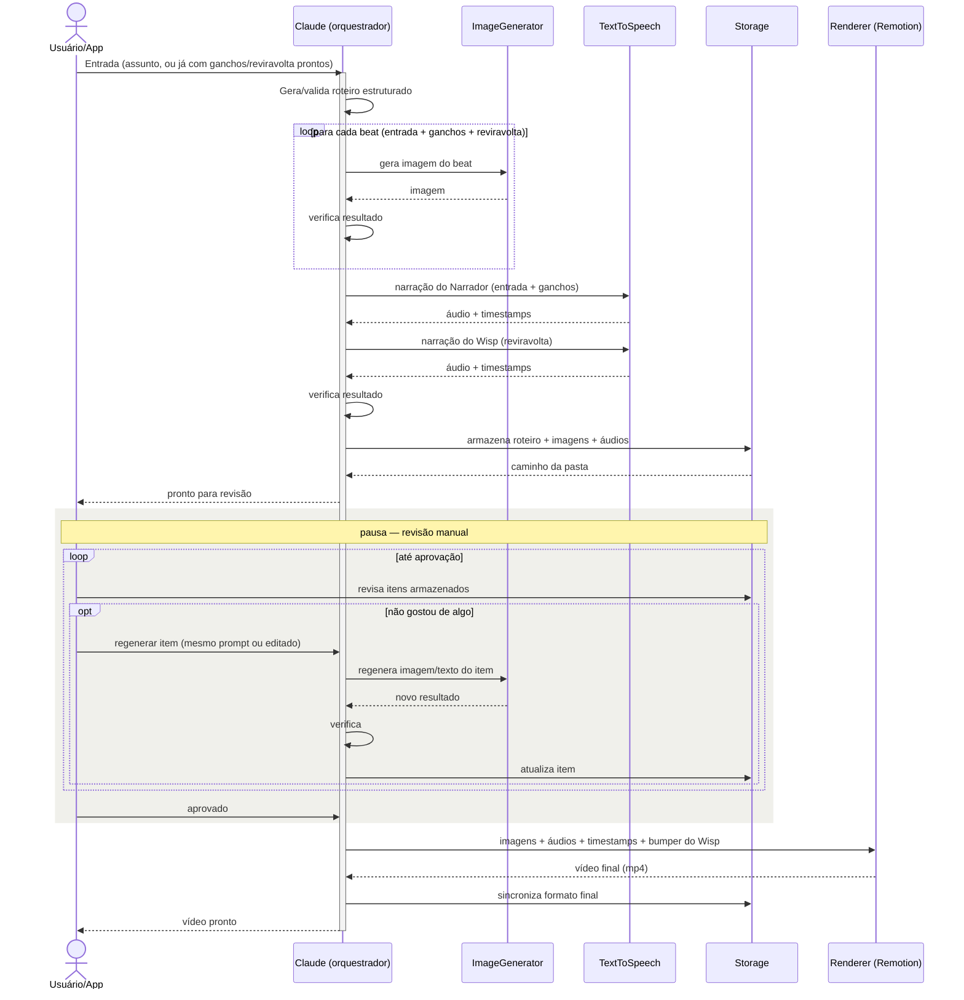

# Wisp — Plano Técnico

> Pipeline (majoritariamente automatizado, com pausas de revisão) que gera um vídeo curto vertical (formato Reels) por dia a partir de um assunto/frase: roteiro estruturado → narração em duas vozes + imagens geradas por IA → renderização com efeitos de movimento, legendas e o bumper do Wisp. Ritmo alvo: 1 vídeo/dia, priorizando qualidade sobre volume — não é uma operação de produção em massa, então custo raramente é o critério decisivo entre opções.
>
> Última atualização: 21 de agosto de 2026. Preços de API verificados em 19/08/2026 — sempre reconferir antes de comprometer orçamento, esse mercado muda rápido.

---

## 1. Estrutura narrativa (regras)

**Entrada → N Ganchos (variável) → Reviravolta**, onde um dos ganchos é marcado como "semente" (contém um detalhe estranho/incompleto) e a reviravolta precisa resolver especificamente essa semente — não uma ironia genérica.

```json
{
  "idioma": "pt-BR",
  "entrada": {
    "id": "e1",
    "texto": "João foi à padaria",
    "imagem_prompt": "menino indo em direção a uma padaria, manhã ensolarada"
  },
  "ganchos": [
    {
      "id": "g1",
      "texto": "João levou 10 reais",
      "imagem_prompt": "menino segurando uma nota de dinheiro",
      "semente": false
    },
    {
      "id": "g2",
      "texto": "João voltou pra casa com os pães e os 10 reais",
      "imagem_prompt": "menino caminhando com pão e dinheiro na mão",
      "semente": true
    }
  ],
  "reviravolta": {
    "texto": "Outro cliente tinha pago os pães do João",
    "imagem_prompt": "cliente sorridente pagando na padaria",
    "resolve": "g2"
  }
}
```

Regras a manter:
- `ganchos` é array de tamanho livre (recomendado: 2–5, por limite de duração do Reels).
- `resolve` deve apontar pra um `id` real dentro de `ganchos` — se o LLM não conseguir, é sinal de regenerar o roteiro.
- Cada nó (entrada, cada gancho, reviravolta) gera exatamente **uma imagem**.
- Duração alvo de narração: 15–30s (~40–75 palavras no total).
- `entrada` + `ganchos` são narrados pelo **Narrador**; `reviravolta` é narrada pelo **Wisp** (seção 2).

**Modos de entrada** (três níveis de controle, o pipeline aceita qualquer um):
1. **Só o assunto** — Claude gera ganchos e reviravolta do zero.
2. **Assunto + ganchos prontos** — Claude cria só a reviravolta e os `imagem_prompt` de cada item.
3. **Roteiro completo pronto** — Claude só valida a estrutura (checa se `resolve` aponta pra uma semente real) e gera os `imagem_prompt`.

Nos três modos a chamada ao Claude pra gerar `imagem_prompt` e validar a estrutura acontece de qualquer forma — o custo/latência dessa etapa não muda muito entre os modos.

**Regras de conteúdo**:
- A fala do Wisp (reviravolta) segue um guia de estilo próprio no prompt — sádico, irônico, **nunca diretamente cruel** — separado do prompt neutro usado pra entrada/ganchos. Esse é o limite de tom concreto pro personagem.
- Ainda em aberto: já que o sistema gera afirmações automaticamente sobre qualquer assunto, existe risco de desinformação. Decidir se o roteiro fica restrito a temas mais subjetivos/seguros (histórias cotidianas, curiosidades) ou se implementa alguma checagem antes de publicar.

---

## 2. Personagens: Narrador e Wisp

Dois personagens que não interagem entre si: o **Narrador** apresenta a história (entrada + ganchos), o **Wisp** entrega a reviravolta/ironia e encerra o vídeo. É a marca registrada do projeto.

### 2.1 Vozes

| | Narrador | Wisp |
|---|---|---|
| Cobre | entrada + ganchos | reviravolta |
| Tom | voz normal, sem característica chamativa | sádico, irônico, nunca cruel |
| Provedor | ElevenLabs | ElevenLabs |

**Por que ElevenLabs pras duas vozes** (revisando a escolha original, que era Amazon Polly por custo/timestamp): o Wisp precisa de atuação real — controle de prosódia é o ponto forte do ElevenLabs, e isso importa mais que economizar centavos numa operação de 1 vídeo/dia. Bônus: como o conteúdo é bilíngue (PT-BR/EN), o ElevenLabs mantém a mesma identidade de voz nos dois idiomas, então cada personagem soa como "a mesma pessoa" em qualquer idioma — essencial pra uma voz de marca.

Regra importante: o `voice_id` de cada personagem é **fixo para sempre**, nunca varia entre vídeos — diferente das imagens da história, onde alguma variação é tolerável.

Implementação: 2 chamadas de TTS por vídeo (uma por voz), áudios concatenados na montagem.

### 2.2 Identidade visual do Wisp

O Narrador é só voz. O Wisp tem forma visual — um efeito recorrente, **reutilizado em todo vídeo** (mesmo asset sempre, não gerado de novo a cada vez).

**Conceito**: fumaça cobre a tela → olhos e boca aparecem em meio à fumaça enquanto o Wisp fala → depois da fala, a fumaça se dissipa lentamente.

**Direção visual definida**: sorriso arredondado e simétrico, sem dentes, brilho âmbar pálido — não vermelho. Uma primeira referência gerada (fumaça escura, olhos/boca vermelho-sangue, dentes serrilhados) foi descartada por ler como "maligno" — o Wisp deve ler como travesso/sarcástico, nunca cruel, o que pede formas arredondadas em vez de pontudas e fuga do vermelho (cor universal de perigo/demônio). Coincidência favorável: "Wisp" remete a *will-o'-the-wisp*, a luz fantasma do folclore que engana viajantes por brincadeira, sempre descrita com luz pálida azulada/esverdeada — nunca vermelha. O esboço aprovado é só referência de direção; o asset final merece mais capricho (ilustração própria ou geração cuidadosa por IA com esse briefing exato), já que é permanente.

**Por que a animação não pode ser um único vídeo gerado por IA**: a duração da fala do Wisp muda todo dia (a reviravolta não tem tamanho fixo). Um clipe de vídeo gerado por IA tem duração fixa e nunca bateria exatamente com o áudio do dia.

**Abordagem recomendada — separar textura de controle de tempo**:
- Fumaça e rosto (olhos + boca) são **assets fixos**, feitos uma vez. Fumaça: clipe de banco de vídeo (fundo preto, pronto pra blend mode) ou gerado por IA uma única vez — vale investir mais aqui, é permanente. Olhos/boca: asset separado (PNG/SVG com transparência), não gerado dentro do vídeo de fumaça — mais fácil de ajustar a expressão e de compor com timing preciso.
- Composição e tempo são feitos em código, no Remotion, que já lê a duração do áudio pra sincronizar legendas de qualquer forma.

**Estrutura em 3 fases (composição Remotion)**:
1. **Cobrir** (~1–1.5s fixo): fumaça entra, cobrindo a tela.
2. **Revelar + segurar** (**duração variável** = duração do áudio do Wisp menos as fases 1 e 3): olhos e boca aparecem por cima da fumaça (fade-in), fumaça continua em loop curto e perfeito por trás — calculando frames a partir da duração real do áudio. ⚠️ Checar a API atual do Remotion pra isso na hora de implementar (Fase 3.5): `getAudioDurationInSeconds()` já está marcada como deprecated a favor de `getMediaMetadata()`, e a forma de fazer loop mudou algumas vezes — não fixar num nome de função por essas notas, conferir a documentação corrente primeiro.
3. **Dissipar** (~1–1.5s fixo): olhos/boca somem, fumaça se abre (pode ser o clipe da fase 1 em reverso).

Esse bumper é autocontido — não depende do resto do pipeline pronto. Dá pra prototipar em paralelo às Fases 1–3 (seção 6).

---

## 3. Arquitetura



### 3.1 Revisão manual (duas pausas)

Duas pausas, em pontos diferentes do processo — o pipeline não segue sozinho até o fim em nenhuma delas.

**Pausa 1 — só texto** (só no modo 1, "só o assunto"): logo depois que o roteiro é gerado, antes de gastar com imagens. Ler e ajustar o roteiro custa segundos e é de graça; gerar 5 imagens de uma história que você ia querer mudar mesmo assim é desperdício.

**Pausa 2 — revisão completa** (sempre): depois que roteiro, imagens e áudios estão salvos no storage, antes do render.

**Estados do job** (campo `status` no Prisma): `gerando_roteiro` → [`aguardando_revisao_roteiro` se modo 1] → `gerando_midia` → `aguardando_revisao` → `renderizando` → `concluido` (+ `falhou`).

**Mecanismo** (via CLI/endpoints simples, sem UI dedicada por enquanto):
- Os itens já estão em `storage/<job_id>/` (roteiro.json, imagens, áudios) — dá pra abrir direto, sem precisar de nada especial.
- `regenerar item`: reroda a geração de um item específico (imagem, áudio, ou texto de um gancho), com o mesmo prompt ou um prompt editado, sobrescrevendo o arquivo. Passa pela mesma verificação de sempre.
- `aprovar`: avança o status (de `aguardando_revisao_roteiro` pra `gerando_midia`, ou de `aguardando_revisao` pra `renderizando`).
- Troca manual do arquivo também funciona — o render só lê o que estiver na pasta, não se importa com a origem.
- Se o texto de um gancho/reviravolta for editado em qualquer uma das pausas, reaplicar a verificação de estrutura (semente/resolve) antes de aprovar.

### Estrutura de backend (Node.js / TypeScript, NestJS)

```
wisp-backend/
├── src/
│   ├── roteiro/         # geração do roteiro estruturado (Claude API)
│   ├── image-gen/       # interface ImageGenerator + implementações por provedor
│   ├── tts/              # interface TextToSpeech + implementações por provedor (Narrador/Wisp)
│   ├── render/            # composições Remotion + trigger de render (inclui bumper do Wisp)
│   ├── storage/            # abstração local disk / S3-compatible
│   ├── pipeline/            # orquestrador: liga tudo, chamado pela fila
│   ├── queue/                 # setup e processors do BullMQ
│   └── common/                  # schema do roteiro, tipos compartilhados
├── remotion/                       # composições/templates React do Remotion
├── prisma/                          # schema do banco (tracking de jobs)
└── .env
```

**Princípio central**: cada generator (imagem, TTS) fica atrás de uma **interface comum** (`ImageGenerator.generate(prompt): Promise<ImageResult>`), com uma implementação concreta por provedor. Isso permite trocar de provedor por configuração, sem tocar no resto do pipeline.

- **Fila**: BullMQ (Redis) — controla concorrência, retries automáticos, tracking de progresso.
- **Banco**: Prisma + SQLite no início (suficiente pra rastrear jobs/roteiros/custos); migrar pra Postgres se o volume justificar.
- **Storage**: disco local para desenvolvimento/testes; migrar para armazenamento compatível com S3 (Cloudflare R2 é uma opção a avaliar por não cobrar taxa de saída de dados) quando for para produção.
- **Render**: Remotion rodando como processo dentro do próprio backend (ou worker separado).

---

## 4. Decisões de API por componente

### 4.1 Roteiro (LLM)

| Modelo | Preço (por MTok, entrada/saída) |
|---|---|
| Claude Haiku 4.5 | $1 / $5 |
| **Claude Sonnet 5** ✅ | **$2 / $10** |
| Claude Opus 5 | $5 / $25 |

**Recomendação**: Sonnet 5, chamada **síncrona** (API normal, sem Batch API). A Batch API foi cogitada antes por causa do desconto de 50%, mas ela adiciona latência (processamento pode levar minutos a horas) — isso atrapalha o loop rápido de "gera → revisa → ajusta" que faz sentido pro ritmo de 1 vídeo/dia. Na escala do projeto, a diferença de custo entre síncrono e batch é centavos por mês — não compensa a espera.

Custo estimado: **~$0,008 por roteiro**.

### 4.2 Narração (TTS)

**Recomendação**: **ElevenLabs** para as duas vozes (Narrador e Wisp) — ver raciocínio completo na seção 2.1. Prioriza controle de prosódia e consistência de identidade de voz entre PT-BR/EN sobre economia de custo, já que o volume (1 vídeo/dia) torna a diferença de preço irrelevante.

| Provedor | Preço (por 1M caracteres) | Timestamp por palavra nativo | Observação |
|---|---|---|---|
| Google Cloud (Standard/WaveNet) | $4 | ❌ | mais barato, mas sem timestamp nativo |
| Amazon Polly (Neural) | ~$16 (+~$16 se pedir timestamp — Speech Marks é cobrado à parte, dobra o custo efetivo) | ✅ | boa opção de custo/feature, mas sem o controle de prosódia que o Wisp pede |
| Azure Speech (Neural) | $16–22 | parcial | |
| OpenAI TTS | $15–30 | ❌ | |
| **ElevenLabs (Multilingual v2/v3)** ✅ | **$100** | ✅ | melhor naturalidade e controle de prosódia; mesma identidade de voz em PT-BR e EN |

Custo estimado: **~$0,04 por vídeo** (2 chamadas — Narrador + Wisp — usando a camada Multilingual pela qualidade/consistência entre idiomas).

### 4.3 Geração de imagem

| Provedor/modelo | Preço por imagem | Observação |
|---|---|---|
| GPT Image (Mini) | $0,005 | mais barato, qualidade/consistência não testada por nós ainda |
| Google Imagen 4 (Fast) | $0,02 | bom custo-benefício |
| Google Imagen 4 (Standard/Ultra) | $0,04 / $0,06 | |
| **Gemini 3.1 Flash Image / Nano Banana 2 (Lite)** ✅ | **~$0,034** | citado especificamente por força em consistência de personagem/estilo |
| Gemini 3.1 Flash Image / Nano Banana 2 (padrão) | ~$0,067 | mesma vantagem de consistência, maior resolução |
| Flux 2 Pro | ~$0,055 | boa qualidade fotorrealista; **licença comercial paga separada da API** (checar termos) |
| Ideogram 3.0 | $0,03–0,09 | especializado em texto legível dentro da imagem — não é nosso caso de uso |
| Modelos open-weight via agregador (Replicate/FAL) | $0,002–0,02 | mais barato, mas exige mais engenharia de prompt pra manter consistência entre imagens |

**Recomendação**: começar com **Nano Banana 2 (Lite)** — é o único da lista com uma vantagem explícita documentada em consistência visual entre gerações, que é nosso maior risco técnico. Comparar lado a lado com Imagen 4 Fast em teste real antes de decidir.

Custo estimado: **~$0,10–0,34 por vídeo** (5 imagens) — de longe o maior componente de custo do pipeline, mesmo com o volume baixo.

### 4.4 Renderização

**Remotion**, licença **Free** — indivíduos e empresas com até 3 funcionários usam de graça, incluindo uso comercial e vídeos ilimitados. Roda self-hosted, sem custo adicional de "serviço de render".

---

## 5. Estimativa de custo total

Com o ritmo real do projeto (1 vídeo/dia, ~30/mês), custo deixa de ser um critério decisivo entre opções técnicas — as diferenças entre provedores somam poucos dólares por mês. A tabela existe pra referência, não pra guiar a escolha.

| Componente | Custo por vídeo |
|---|---|
| Roteiro (Sonnet 5, síncrono) | ~$0,008 |
| TTS (ElevenLabs, 2 vozes) | ~$0,04 |
| Imagens (5x, Nano Banana Lite) | ~$0,17 |
| Render (Remotion) | $0 |
| **Total/vídeo** | **~$0,22** |
| **~30 vídeos/mês (ritmo do projeto)** | **~$6,60/mês** |

---

## 6. Plano de fases

### Fase 0 — Setup
- Repositório Node/TS, estrutura de pastas acima, gerenciamento de `.env`, lint/CI básico.
- **Saída**: projeto vazio rodando, sem lógica ainda.

### Fase 1 — Roteiro ✅ implementada (falta testar com API key real)
- Implementar geração do JSON estruturado via Claude API (Sonnet 5, síncrono), com few-shot examples guiando tom/estilo dos ganchos e um guia de estilo separado pra voz do Wisp na reviravolta.
- Validar contra vários assuntos de teste, incluindo assuntos "difíceis" sem ironia óbvia.
- Implementar a Pausa 1 (revisão de texto, modo 1).
- **Saída**: dado um assunto em texto, o sistema devolve um JSON válido seguindo o schema da seção 1, de forma consistente, com pausa pra revisão antes de seguir.

**Decisão técnica**: geração via `tool_use` com `tool_choice` forçado, não o
recurso beta "structured outputs" (`output_format`) da Claude API. Motivo:
verificado na implementação que esse beta exige um header específico
(`anthropic-beta: structured-outputs-2025-11-13`) e a documentação lista
suporte só pra Sonnet 4.5/Opus 4.1 — não pro Sonnet 5 que escolhemos.
`tool_use` é GA desde 2024 e funciona em qualquer modelo atual; a troca é
validar o schema com Zod depois de receber, em vez de o schema ser garantido
pela própria API. Essa foi pesquisada *antes* de escrever o código, diferente
das correções reativas da Fase 0 — o processo da seção de riscos abaixo
sendo seguido de forma proativa dessa vez.

**O que foi validado nesse ambiente** (sem API key real, sem acesso à
`api.anthropic.com` com credenciais): a lógica de validação de estrutura
(`validarRegrasNarrativas`) e a montagem de ids (`montarRoteiro`) têm testes
unitários passando — essa é a lógica mais própria/arriscada, e não depende
de API key nem do client Prisma gerado. O que resta pra confirmar só na sua
máquina, com chave real: se o Claude de fato retorna um `tool_use` bem
formado pros 3 modos de entrada, e se a qualidade dos ganchos/reviravolta
está boa na prática (isso é subjetivo, não dá pra testar por script).

### Fase 2 — TTS
- Integrar ElevenLabs, com dois `voice_id` fixos (Narrador, Wisp).
- Confirmar extração de timestamp por palavra pras duas vozes.
- Testar qualidade e consistência de identidade em PT-BR e EN.
- **Saída**: dado o roteiro, o sistema devolve dois áudios (Narrador, Wisp) + timestamps por palavra.

### Fase 3 — Geração de imagem
- Integrar Nano Banana 2 (ou alternativa), gerar as N+2 imagens de uma história.
- Testar consistência visual entre imagens da mesma história.
- **Saída**: dado o roteiro completo, o sistema devolve uma imagem por beat, visualmente consistentes entre si.

### Fase 3.5 — Bumper do Wisp (pode ser feita em paralelo às Fases 1–3)
- Produzir/gerar o asset de fumaça e o asset de olhos/boca (seção 2.2).
- Montar a composição Remotion de 3 fases (cobrir/revelar+segurar/dissipar) com duração dinâmica baseada no áudio do Wisp.
- **Saída**: componente Remotion reutilizável que recebe uma duração de áudio e devolve a animação do Wisp sincronizada.

### Fase 4 — Renderização
- Composição Remotion: imagens com efeito de movimento (pan/zoom estilo Ken Burns) sincronizadas com a narração via timestamps, + legenda estilizada + bumper do Wisp (Fase 3.5) no encerramento.
- **Saída**: dado imagens + áudios + timestamps + bumper, o sistema renderiza um .mp4 1080x1920.

### Fase 5 — Orquestração fim a fim
- Ligar tudo via BullMQ: roteiro → (Pausa 1, se modo 1) → imagens (paralelo) → TTS (Narrador + Wisp) → storage → Pausa 2 → render.
- Implementar os comandos da seção 3.1 (regenerar item, aprovar) e o rastreamento de status do job.
- Tratamento de erro/retry em cada etapa.
- **Saída**: dado um assunto (em qualquer um dos 3 modos de entrada), o pipeline gera e armazena tudo, pausa pra revisão nos pontos certos, e renderiza assim que aprovado.

### Fase 6 — Testes e refinamento
- Rodar com temas variados, monitorar custo real vs. estimado, refinar prompts com base nos resultados.
- Decidir se algum provedor precisa ser trocado com base em qualidade observada.

---

## 7. Riscos e questões em aberto

- **Consistência visual** das imagens da história é o maior risco técnico — mitigar com prompt de estilo fixo por história e/ou escolha de provedor com boa consistência nativa (seção 4.3). O Wisp evita esse problema por não ser regenerado por IA a cada vídeo (seção 2.2).
- **Automação via navegador (Playwright)**: só usar como *script* rodando no próprio backend, nunca como MCP ao vivo guiando cada geração — e só para uma ferramenta específica sem API cujo custo por assinatura compense a manutenção extra.
- **Licenciamento**: Flux (Black Forest Labs) exige licença comercial separada da API para uso comercial — checar antes de adotar. Remotion é gratuito para o seu caso.
- **Políticas de conteúdo sintético**: plataformas como Instagram vêm evoluindo regras sobre rotulagem de conteúdo gerado por IA — reconferir antes de publicar em escala.
- **Publicação automática**: este plano cobre gerar o arquivo de vídeo pronto. Publicar automaticamente no Instagram exigiria integração separada com a Graph API da Meta, conta business e processo de aprovação do app.
- **Regras de conteúdo contra desinformação**: segue sem definição (seção 1) — não bloqueia a Fase 1, mas precisa de decisão antes de publicar em escala.
- **Bibliotecas específicas mudam rápido**: já apareceram 4 casos reais nesse projeto, em duas rodadas de verificação. Prisma 7 mudou onde a URL do banco é configurada e passou a exigir driver adapter; o `BullModule` do NestJS/BullMQ não aceita `{ url }` dentro de `connection` (precisa de uma instância do ioredis); o helper `env()` do `prisma.config.ts` lança erro se a variável não existir — o que quebrava `npm install` num clone novo, antes mesmo de existir um `.env` (resolvido usando `process.env` com fallback); e o generator `prisma-client-js` que a Fase 0 usava inicialmente já está descontinuado a partir do Prisma 7 (trocado pelo `prisma-client` novo, que por sua vez precisa de `moduleFormat = "cjs"` pra funcionar com o CommonJS do NestJS). Em todos os casos a sintaxe "padrão" conhecida de antemão estava desatualizada. Ao implementar cada fase (2, 3, 3.5, 4), vale pesquisar a versão atual da lib específica antes de codar contra ela, em vez de confiar só em conhecimento geral — principalmente em bibliotecas de infraestrutura (ORM, fila, render) que mudam configuração com mais frequência que a lógica de negócio em si.
- **Prisma está mudando rápido até *dentro* da versão 7**: o tipo `PrismaConfig` (de `@prisma/config`) ganhou/perdeu o campo `datasource` entre patches — o mesmo `prisma.config.ts`, sem nenhuma mudança nossa, compilou certo numa reinstalação e deu erro de tipo (`datasource does not exist`) noutra, só pela versão resolvida ter mudado de 7.9.1 pra outra em poucos dias. Duas correções: (1) `prisma.config.ts` agora está excluído da compilação do NestJS em `tsconfig.build.json` — quem carrega esse arquivo é a CLI do Prisma, não o `nest build`/`nest start`, então ele não precisa (e não deveria) passar pelo `tsc` do projeto; (2) as versões do `prisma`/`@prisma/client`/`@prisma/adapter-better-sqlite3` no `package.json` foram fixadas sem `^` (exatas), pra reinstalações futuras não puxarem uma versão diferente da testada sem avisar. Se atualizar essas versões de propósito no futuro, atualizar as 3 juntas e testar de novo.
- **Nem tudo aparece só pesquisando com antecedência**: o npm 12 passou a bloquear script de instalação de dependências não aprovadas (`better-sqlite3` incluso — crítico, é o binário nativo do SQLite) por padrão, uma mudança recente o suficiente que só apareceu rodando `npm install` de verdade, não numa checagem de código isolada. Resolvido com um campo `allowScripts` no `package.json`. Vale considerar rodar `npm install` num ambiente limpo (ou pedir pra rodar e colar o resultado) ao final de cada fase que adicionar dependência nova, não só revisar o código.
- **Vulnerabilidade conhecida aceita por ora**: `npm audit` acusa alta severidade em `deepmerge-ts` (usado internamente pelo `@prisma/config` pra mesclar configuração) — é stack exhaustion em objetos recursivos, mas o `@prisma/config` só usa isso pra mesclar o nosso próprio `prisma.config.ts`, não input de usuário ou de rede. Risco prático baixo. O fix sugerido pelo npm (`audit fix --force`) rebaixaria o Prisma pra 6.12.0, desfazendo a migração pro Prisma 7 inteira — não vale a troca. Reavaliar quando o Prisma atualizar essa dependência internamente (patch não-breaking) ou na próxima migração de major version.
- **Prisma 8 já tem release candidate (8.0.0-rc.10)**: não migrar agora — é pré-lançamento, e o 7.9.1 acabou de ser validado funcionando de ponta a ponta depois de 3 rodadas de correção. Tratar upgrade de major version como decisão deliberada e isolada quando (e se) virar estável, não como reação automática ao aviso do CLI.

---

## 8. Próximos passos imediatos

1. Criar o repositório e a estrutura de pastas (Fase 0).
2. Implementar o gerador de roteiro (Fase 1) e testar com 10–15 assuntos variados antes de seguir adiante.
3. Em paralelo, quando houver tempo: prototipar o bumper do Wisp (Fase 3.5) — é autocontido e não bloqueia o resto.
